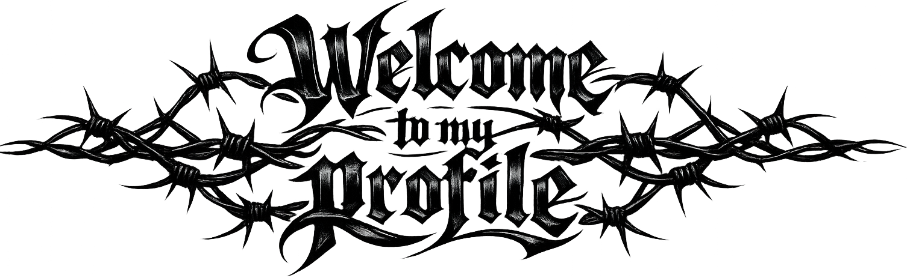
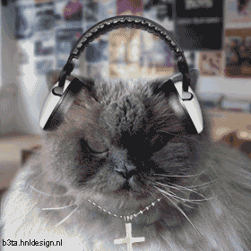
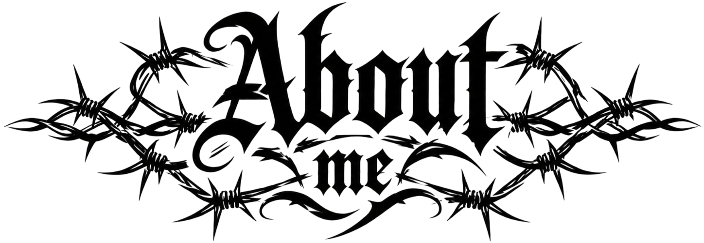
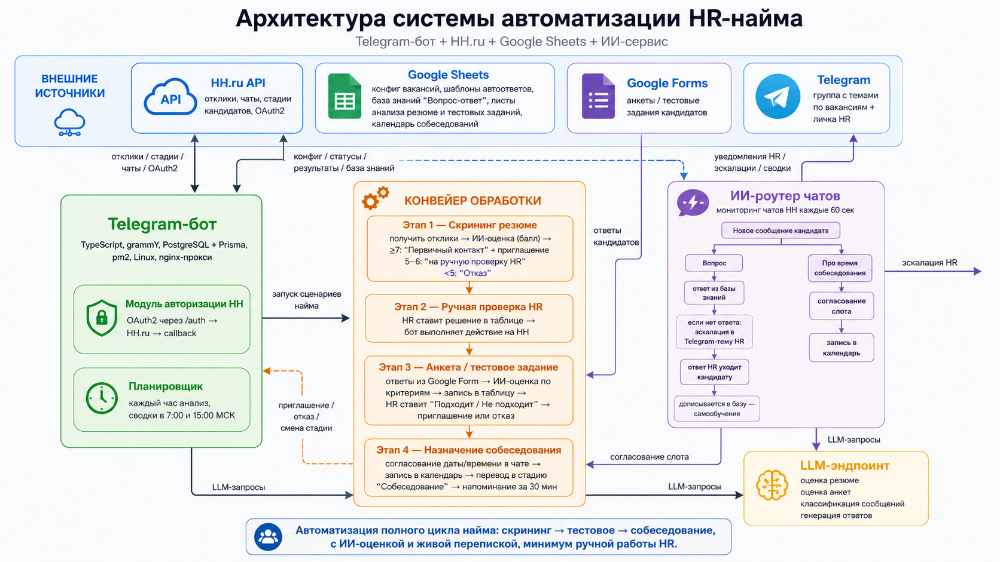
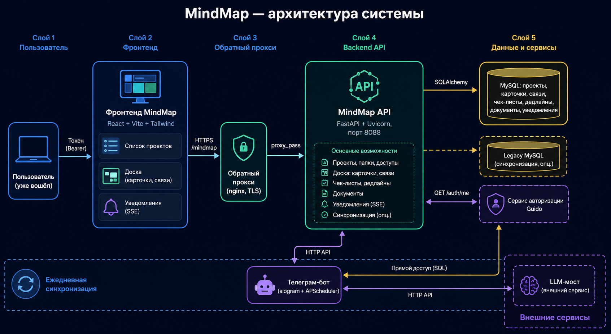
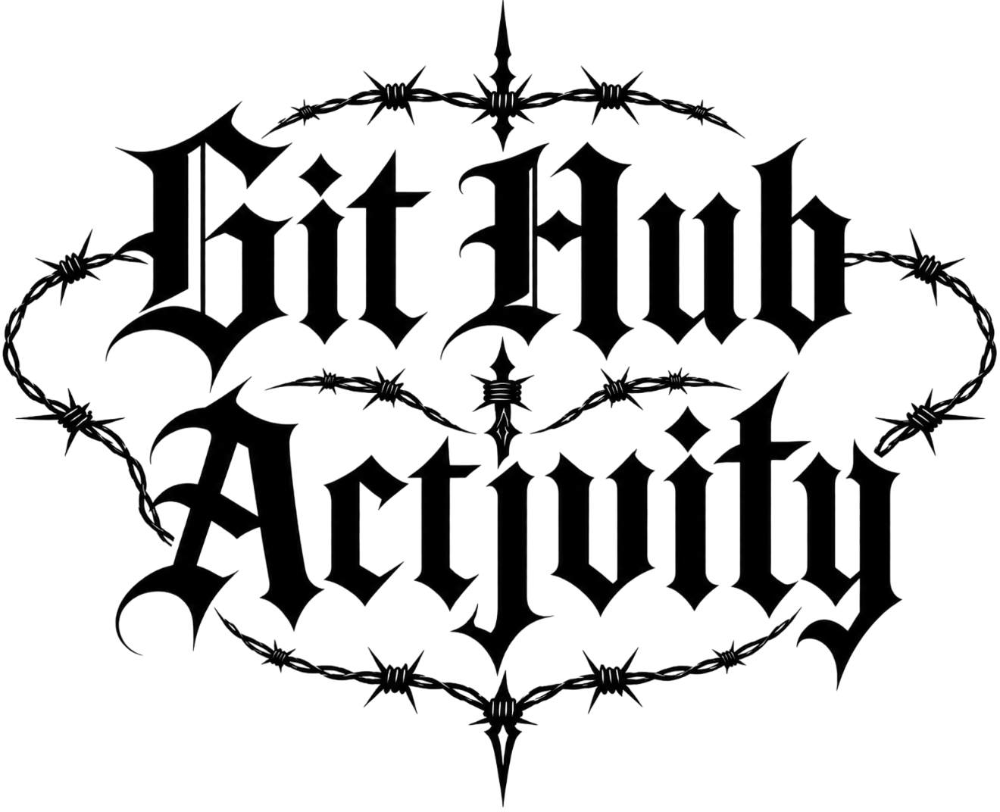
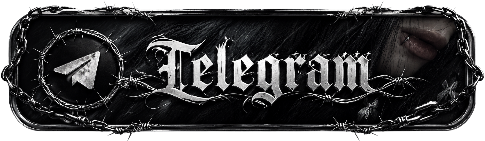
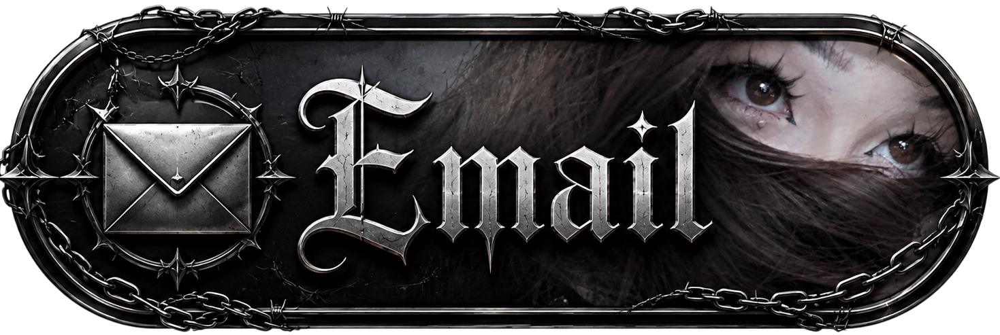

  <picture>
    <source media="(prefers-color-scheme: dark)" srcset="assets/chain-dark-theme-Photoroom.png">
    <source media="(prefers-color-scheme: light)" srcset="assets/chain-light-theme-Photoroom.png">
    
  </picture>

  <picture>
    <source media="(prefers-color-scheme: dark)" srcset="assets/title-dark-theme-Photoroom.png">
    <source media="(prefers-color-scheme: light)" srcset="assets/title-light-theme.png">
    
  </picture>

  <picture>
    <source media="(prefers-color-scheme: dark)" srcset="assets/chain-dark-theme-Photoroom.png">
    <source media="(prefers-color-scheme: light)" srcset="assets/chain-light-theme-Photoroom.png">
    
  </picture>

 

  
  
  
  
  

  <picture>
    <source media="(prefers-color-scheme: dark)" srcset="assets/chain-dark-theme-Photoroom.png">
    <source media="(prefers-color-scheme: light)" srcset="assets/chain-light-theme-Photoroom.png">
    
  </picture>

  <picture>
    <source media="(prefers-color-scheme: dark)" srcset="assets/about-me-dark-new.png">
    <source media="(prefers-color-scheme: light)" srcset="assets/about-me-light-new.png">
    
  </picture>

  <picture>
    <source media="(prefers-color-scheme: dark)" srcset="assets/chain-dark-theme-Photoroom.png">
    <source media="(prefers-color-scheme: light)" srcset="assets/chain-light-theme-Photoroom.png">
    
  </picture>

<h1 align="center">Привет</h1>

<h3 align="center">
  Junior Backend Developer с фокусом на AI-автоматизацию, ботов и backend-сервисы
</h3>

  Я активно развиваюсь в backend-разработке и учусь создавать практичные сервисы,
  которые работают с API, базами данных, Telegram-ботами, парсерами и AI-интеграциями. Буду рад обратной связи по моему текущему уровню и проектам..

  Мне интересно делать не просто учебные примеры, а реальные инструменты:
  автоматизацию бизнес-процессов, обработку данных, ботов, парсеры,
  AI-агентов и backend-сервисы для задач бизнеса.

  <picture>
    <source media="(prefers-color-scheme: dark)" srcset="assets/chain-dark-theme-Photoroom.png">
    <source media="(prefers-color-scheme: light)" srcset="assets/chain-light-theme-Photoroom.png">
    
  </picture>

  <picture>
    <source media="(prefers-color-scheme: dark)" srcset="assets/level-dark.png">
    <source media="(prefers-color-scheme: light)" srcset="assets/level-light.png">
    
  </picture>

  <picture>
    <source media="(prefers-color-scheme: dark)" srcset="assets/chain-dark-theme-Photoroom.png">
    <source media="(prefers-color-scheme: light)" srcset="assets/chain-light-theme-Photoroom.png">
    
  </picture>

  Честная самооценка: я активно учусь и постепенно усиливаю практические навыки.
  В части проектов использую AI как инструмент для ускорения разработки, но стараюсь разбирать,
  проверять и дорабатывать архитектуру, логику и сгенерированные фрагменты кода.
  Проценты показывают не “идеальное знание”, а мой текущий уровень уверенности в каждой технологии.

  
  <b>TypeScript</b> — █████░░░░░ 50%
   
  Использую для backend-разработки, DTO, интерфейсов, типизации данных и структуры сервисов.
  На данный момент это мой приоритетный язык, на котором планирую активно развиваться в ближайшее время.

  
  <b>Python</b> — █████░░░░░ 50%
   
  Использую для скриптов, парсеров, Telegram-ботов, транскрибации, обработки данных и AI-задач.
  В рабочих задачах часто встречается автоматизация бизнес-процессов с использованием AI-инструментов,
  поэтому Python стал для меня одним из основных инструментов.

  
  <b>Node.js</b> — ████▌░░░░░ 45%
   
  Работаю с серверной логикой, API, роутами, сервисами и интеграциями.

  
  <b>NestJS</b> — ████▌░░░░░ 45%
   
  Изучаю backend-архитектуру через модули, контроллеры, сервисы, DTO и работу с базой данных.
  Сейчас активно работаю с этим фреймворком. Выбор между Express и NestJS сделал в пользу NestJS,
  потому что мне ближе его готовая структура, модульность, dependency injection и подход через декораторы.

  
  <b>PostgreSQL</b> — ████░░░░░░ 40%
   
  Работаю с таблицами, связями, миграциями, хранением данных и базовыми SQL-запросами.
  Постепенно углубляюсь в проектирование схем и работу с реляционными данными.

  
  <b>Prisma</b> — ████▌░░░░░ 45%
   
  Использую Prisma как ORM для подключения backend-приложений к PostgreSQL.
  В дальнейшем планирую изучить и другие подходы к работе с базами данных и ORM.

  
  <b>Docker</b> — ████░░░░░░ 40%
   
  Запускаю контейнеры, работаю с сервисами на VPS и постепенно изучаю деплой,
  окружения и контейнеризацию приложений.

  
  <b>Linux / VPS</b> — ████▌░░░░░ 45%
   
  Настраиваю серверы, смотрю логи, процессы, память, диск, Docker и окружение проектов.

  
  <b>React</b> — ███░░░░░░░ 30%
   
  Использую для простых интерфейсов, dashboard-страниц и frontend-части учебных проектов.
  В рабочих веб-приложениях React полезен для создания динамических интерфейсов,
  компонентной структуры и удобного отображения данных с сервера.

  
  <b>Git / GitHub</b> — ████▌░░░░░ 45%
   
  Работаю с репозиториями, README, оформлением профиля, коммитами и структурой проектов.

  <picture>
    <source media="(prefers-color-scheme: dark)" srcset="assets/chain-dark-theme-Photoroom.png">
    <source media="(prefers-color-scheme: light)" srcset="assets/chain-light-theme-Photoroom.png">
    
  </picture>

  <picture>
    <source media="(prefers-color-scheme: dark)" srcset="assets/automation-dark-new.png">
    <source media="(prefers-color-scheme: light)" srcset="assets/automation-light-new.png">
    
  </picture>

  <picture>
    <source media="(prefers-color-scheme: dark)" srcset="assets/chain-dark-theme-Photoroom.png">
    <source media="(prefers-color-scheme: light)" srcset="assets/chain-light-theme-Photoroom.png">
    
  </picture>

  <b>Telegram Bots</b> — █████░░░░░ 50%
   
  Делаю ботов для уведомлений, учёта данных, работы с таблицами и автоматизации процессов.
  На данный момент часть ботов активно используется в рабочих процессах компании.

  <b>AI / LLM Integrations</b> — █████▌░░░░ 55%
   
  Подключаю LLM к сервисам для анализа текста, резюме, сообщений и автоматизации решений.
  Основной интерес — практическое применение AI в backend-сервисах, ботах и бизнес-автоматизации.

  <b>Google Sheets API</b> — ████▌░░░░░ 45%
   
  Использую Google Sheets как простой интерфейс для данных, настроек, отчётов и интеграций с ботами.

  <b>n8n / Workflow Automation</b> — ████░░░░░░ 40%
   
  Собираю автоматизации через вебхуки, API, интеграции и обработку данных между сервисами.

  <b>Parsers / Data Processing</b> — ████▌░░░░░ 45%
   
  Пишу парсеры, обработчики данных и небольшие инструменты для автоматизации рутинных задач.

 

  

  <picture>
    <source media="(prefers-color-scheme: dark)" srcset="assets/chain-dark-theme-Photoroom.png">
    <source media="(prefers-color-scheme: light)" srcset="assets/chain-light-theme-Photoroom.png">
    
  </picture>

  <picture>
    <source media="(prefers-color-scheme: dark)" srcset="assets/project-dark.png">
    <source media="(prefers-color-scheme: light)" srcset="assets/project-light.png">
    
  </picture>

  <picture>
    <source media="(prefers-color-scheme: dark)" srcset="assets/chain-dark-theme-Photoroom.png">
    <source media="(prefers-color-scheme: light)" srcset="assets/chain-light-theme-Photoroom.png">
    
  </picture>

<h3 align="center">
  
</h3>

<h3 align="center">
  HH.ru AI Automation — бот для автоматизации найма
</h3>

  Telegram-бот, который автоматизирует обработку откликов на HH.ru:
  скрининг резюме, оценку тестовых заданий через LLM, Q&A с кандидатами,
  согласование собеседований и уведомления HR.

  
  
  
  
  
  
  

  

  <b>Что реализовано:</b>

<ul>
  <li>Получение откликов и работа со стадиями кандидатов через HH.ru API</li>
  <li>LLM-оценка резюме и тестовых заданий по заданным критериям</li>
  <li>Human-in-the-loop: финальное решение остаётся за HR</li>
  <li>Q&A по базе знаний с эскалацией вопросов в Telegram</li>
  <li>Согласование собеседований и напоминания за 30 минут</li>
  <li>Google Sheets как интерфейс для HR: конфиги, шаблоны, аналитика и база знаний</li>
</ul>

  
<b>Показать архитектурную схему</b>

 

  

<h3 align="center">
  MindMap — full-stack сервис визуальных досок
</h3>

  Визуальная доска для планирования проектов: карточки на canvas, связи между задачами,
  чек-листы, дедлайны, приоритеты, документы, совместный доступ и уведомления в реальном времени.

  
  
  
  
  
  
  
  

  

  <b>Что реализовано:</b>

<ul>
  <li>Список проектов, папки, закрепление, архивирование и тёмная/светлая тема</li>
  <li>Canvas-доска с карточками, drag&drop, зумом, панорамированием и связями между карточками</li>
  <li>Чек-листы, дедлайны, важность, срочность и расчёт приоритета задач</li>
  <li>Прикрепление документов и изображений к карточкам</li>
  <li>Совместный доступ к доскам с управлением правами</li>
  <li>Real-time уведомления через Server-Sent Events с fallback на polling</li>
  <li>Telegram-бот для ежедневной синхронизации задач и уведомлений</li>
  <li>Интеграция с общей авторизацией Guido через Bearer-токен</li>
</ul>

  
<b>Показать архитектурную схему</b>

 

  

<h3>📦 Telegram Material Tracking Bot</h3>

  Telegram-бот для учёта движения материалов между отделами, складами и производственными участками.
  Идея проекта — автоматически собирать сообщения из рабочих чатов и записывать данные в таблицы.

  
  
  
  

  

<h3>🎧 Video Transcriber + Semantic Search</h3>

  Проект для скачивания аудио, транскрибации через Whisper,
  создания эмбеддингов и поиска по смыслу внутри видео или аудиоматериалов.

  
  
  
  
  

  

  <b>Раздел с проектами будет пополняться по мере выполнения новых задач и публикации новых репозиториев.</b>

  <picture>
    <source media="(prefers-color-scheme: dark)" srcset="assets/chain-dark-theme-Photoroom.png">
    <source media="(prefers-color-scheme: light)" srcset="assets/chain-light-theme-Photoroom.png">
    
  </picture>

  <picture>
    <source media="(prefers-color-scheme: dark)" srcset="assets/github-dark.png">
    <source media="(prefers-color-scheme: light)" srcset="assets/github-light.png">
    
  </picture>

  <picture>
    <source media="(prefers-color-scheme: dark)" srcset="assets/chain-dark-theme-Photoroom.png">
    <source media="(prefers-color-scheme: light)" srcset="assets/chain-light-theme-Photoroom.png">
    
  </picture>

  <picture>
    <source media="(prefers-color-scheme: dark)" srcset="assets/top-language-dark.png">
    <source media="(prefers-color-scheme: light)" srcset="assets/top-language.png">
    
  </picture>

  <picture>
    <source media="(prefers-color-scheme: dark)" srcset="assets/chain-dark-theme-Photoroom.png">
    <source media="(prefers-color-scheme: light)" srcset="assets/chain-light-theme-Photoroom.png">
    
  </picture>

  <a href="https://t.me/jzxd111">
    <picture>
      <source media="(prefers-color-scheme: dark)" srcset="assets/telegram-dark.png">
      <source media="(prefers-color-scheme: light)" srcset="assets/telegram-light.png">
      
    </picture>
  </a>

  <a href="mailto:gf12658@gmail.com">
    <picture>
      <source media="(prefers-color-scheme: dark)" srcset="assets/email-dark.png">
      <source media="(prefers-color-scheme: light)" srcset="assets/email-light.png">
      
    </picture>
  </a>

  <picture>
    <source media="(prefers-color-scheme: dark)" srcset="assets/chain-dark-theme-Photoroom.png">
    <source media="(prefers-color-scheme: light)" srcset="assets/chain-light-theme-Photoroom.png">
    
  </picture>

